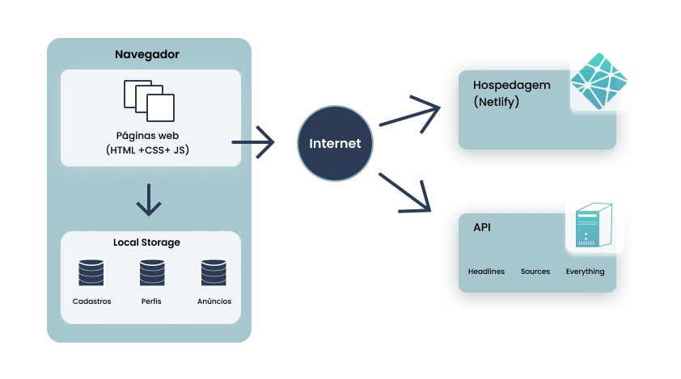

# Arquitetura da Solução

## Diagrama de componentes

Nesta seção são apresentados os detalhes técnicos da solução criada pela equipe, tratando dos componentes que fazem parte da solução e do ambiente de hospedagem da solução.

 

A solução implementada conta com os seguintes módulos:

- **Navegador** - Interface básica do sistema.
  - **Páginas Web** - conjunto de arquivos HTML, CSS, JavaScript e imagens que implementam as funcionalidades do sistema.
  - **Local Storage** - armazenamento mantido no Navegador, onde são implementados bancos de dados baseados em JSON. São eles:
    - **Cadastros** - cadastro de idosos e profissionais cuidadores.
    - **Perfis** - perfis de cuidadores e idosos exibidos no site.
    - **Anúncios** - anúncios de vagas de cuidadores.
- **API** - plataforma que permite o acesso a anúncios de vagas exibidos no site.
- **Hospedagem** - local na Internet onde as páginas são mantidas e acessadas pelo navegador.

## Hospedagem

O site utiliza a plataforma do Netlify como ambiente de hospedagem do site do projeto. O site é mantido no ambiente da URL: [Companhia Senior](https://companhiasenior.netlify.app/) .
